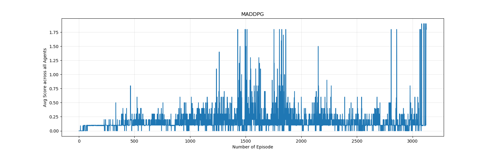

# Project Report

## 1. Multi-Agent Deep Deterministic Policy Gradient

MADDPG is a type of Actor-Critic based methods in reinforcement learning. Main difference between other types of RL is in makes use of critic network which takes care of the variance problem. Core implementation is similar to the previous one. Although, in here, two or various agents run in parallel, the agent can either collaborate or compete in solving the environment. "By independently training the two agents does not work very well because the agents are independently updating their policies as learning progresses. And this causes the environment to appear non-stationary from the viewpoint of any one agent."

## 2. Summary of Params and Hyperparams of the Agent of the Network

*Network Hyperparameters:*
```
TAU = 7e-2
LR_ACTOR = 1e-4
LR_CRITIC = 5e-4
```
*Agent Parameters / Hyperparameters:*
```
BUFFER_SIZE = int(1e4)
BATCH_SIZE = 128
GAMMA = 0.99
WEIGHT_DECAY = 0
UPDATE_EVERY = 2
NUM_UPDATES = 20
```
*Training Parameters:*
```
Total Number of Episodes: 25000
Maximum Number of Timesteps per Episodes: 700
```

## 3. Results

<p align=center></p>

The environment has been solved around 3124 number of episodes. The Batch size, buffer size and tau learning rate was fine tuned in order to achieved the desired results in a faster episodes.

## 4. Further Improvements / Further Works

- Multi-Agent Proximal Policy Gradient
- Agent learns from raw pixel data. (Convolutional Neural Network).
- Continue Learning in different model agent.
- Tuning the network further.
- Multi Agents with A3C and PPO
- Using Batch Normalization in the Networks (Actor Network and Critic Network)
